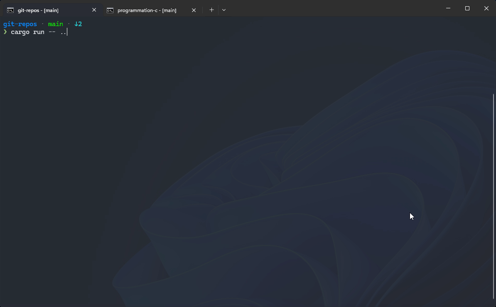

# Git-Repos - 🔍 Scan and manage git repositories



## About This Project

This project is an **experimentation** built entirely using **vibe-coding** with GitHub Copilot. The goal was to explore how easy it is to develop a complete TUI application using only AI assistance, and to evaluate whether the resulting code is maintainable and follows good practices.

**Vibe-coding approach:**

- All code was generated through natural language conversations with GitHub Copilot
- Features were added incrementally by describing the desired functionality
- The AI handled architecture decisions, refactoring, and code organization
- Following the DTDP (Detailed Technical Development Process) with investigation, discussion, action, and summary phases

**Key learnings:**

- TUI development with `ratatui` was straightforward through conversation
- Code quality remained high with proper use of Rust idioms (edition 2024)
- Refactoring and separation of concerns was handled naturally
- Git commits followed conventional commits format consistently

The project serves as a case study for AI-assisted development and demonstrates that maintainable, well-structured code can be created through conversational programming.

> [!NOTE]
> Even the README has been AI generated, except for this line. Apparently Copilot has a high opinion of itself :laughing:

---

## Overview

Git-Repos is a command-line tool with a Text User Interface (TUI) that helps you discover and manage git repositories on your system. It recursively scans directories to find all git repositories and displays them in an interactive table with current branch information.

## Features

- 🔎 **Recursive scanning** - Find all git repositories in a directory tree
- 🎯 **Smart filtering** - Excludes nested repositories (submodules) for cleaner results
- 📊 **Interactive TUI** - Beautiful table interface with rounded borders
- 🌿 **Branch detection** - Shows the current branch for each repository
- 📡 **Remote status** - Displays ahead/behind status, local-only, or up-to-date
- 📝 **Working tree status** - Shows clean, modified, or staged changes
- 📅 **Last commit info** - Display last commit time (relative) and author
- ⚡ **Async loading** - Fast startup with background data loading
- 🔄 **Auto-fetch** - Automatically fetch all repositories with remotes asynchronously
- 🔀 **Auto-update** - Optionally fast-forward merge local branches after fetch
- 🔍 **Search filter** - Press `/` to search repositories by name
- 📋 **View modes** - Filter repositories by: All, Needs Attention, Behind, Modified
- 🎨 **Color-coded display** - Visual indicators for repository states
- ⌨️ **Keyboard navigation** - Vim-style (j/k) and arrow key navigation
- 🚀 **Quick navigation** - Press Enter to change directory to selected repository
- ⚡ **Fast and efficient** - Written in Rust for optimal performance

## Installation

### Via Scoop (preferred)

```powershell
scoop bucket add narnaud https://github.com/narnaud/scoop-bucket
scoop install git-repos
```

### Or via archive files

1. Go to the [Releases](https://github.com/narnaud/git-repos/releases) page
2. Download the latest `git-repos-x86_64-pc-windows-msvc.zip` file
3. Extract the files from it into a directory
4. Add the directory to your PATH

### Build from source

```powershell
git clone https://github.com/narnaud/git-repos.git
cd git-repos
cargo build --release
```

The compiled binary will be in `target/release/git-repos.exe`

## Usage

### Basic usage

Scan the current directory:

```powershell
git-repos
```

Scan a specific directory:

```powershell
git-repos D:\projects
```

By default, the tool automatically fetches all repositories with remotes. To disable this:

```powershell
git-repos --no-fetch
```

To also update local branches with fast-forward merge after fetching:

```powershell
git-repos --update
```

When auto-fetch is enabled (default), the tool runs `git fetch --all --prune` for each repository that has a remote configured. A spinner animation in the status bar shows the progress. With `--update`, it also performs `git merge --ff-only` to update local branches when possible.

### Shell integration (recommended)

Since a program cannot change the shell's working directory, you need to use a wrapper function to enable the "change directory on Enter" feature.

#### PowerShell

Add this to your PowerShell profile (`$PROFILE`):

```powershell
function gr {
    $path = git-repos $args
    if ($LASTEXITCODE -eq 0 -and $path) {
        Set-Location $path
    }
}
```

#### Bash/Zsh

Add this to your `.bashrc` or `.zshrc`:

```bash
gr() {
    local path=$(git-repos "$@")
    if [ $? -eq 0 ] && [ -n "$path" ]; then
        cd "$path"
    fi
}
```

Now you can use `gr` to interactively select and navigate to a repository:

```powershell
gr              # Scan current directory
gr D:\projects  # Scan specific directory
```

### Keyboard controls

- **↑/↓** or **j/k** - Navigate through the repository list
- **[** / **]** - Switch between view modes (All, Needs Attention, Behind, Modified)
- **/** - Enter search mode to filter repositories by name
- **Esc** - Exit search mode and clear search filter
- **Enter** - Change directory to selected repository (exits the app)
- **q** or **Ctrl-C** - Quit the application

### View Modes

- **All** - Show all repositories
- **Needs Attention** - Show repositories that are behind, modified, or have no tracking branch
- **Behind** - Show only repositories that are behind their upstream
- **Modified** - Show only repositories with uncommitted changes

The current mode is highlighted at the bottom right of the table.

### Example output

```text
╭─ Git Repositories - D:\projects ────────────────────────────────────────────────────────────────────────╮
│ Repository              │ Branch  │ Remote Status │ Status     │ Last Commit                          │
├─────────────────────────┼─────────┼───────────────┼────────────┼──────────────────────────────────────┤
│ > kdab/knut             │ main    │ ↑2 ↓0         │ 3M         │ 2 days ago by John Doe               │
│   kdab/training-material│ develop │ up-to-date    │ clean      │ 1 week ago by Jane Smith             │
│   narnaud/git-repos     │ main    │ local-only    │ 1S 2M      │ 5 minutes ago by Nicolas Arnaud      │
│   oss/ratatui           │ main    │ ⟳ loading...  │ clean      │ ⟳ loading...                         │
├─────────────────────────┴─────────┴───────────────┴────────────┴──All─[Needs Attention]─Behind─Modified┤
╰──────────────────────────────────────────────────────────────────────────────────────────────────────────╯
Found 4 repositories | ⠋ Fetching 2 repositories... | Mode: [/] | Search: / | Quit: q or Ctrl-C
```

#### Color indicators

**Remote Status:**

- 🟢 Green - `up-to-date`
- 🔵 Cyan - `↑X ↓Y` (ahead/behind)
- 🟡 Yellow - `no-tracking`
- 🔴 Red - `local-only`
- ⚫ DarkGray - `⟳ loading...`

**Working Tree Status:**

- 🟢 Green - `clean`
- 🟡 Yellow - `XM` (modified), `XS` (staged), `XS YM` (both)
- ⚫ DarkGray - `⟳ loading...` or `unknown`

## Contributing

Contributions are welcome! Please feel free to submit a Pull Request.

## License

MIT License - Copyright (c) Nicolas Arnaud-Cormos

See [LICENSE](LICENSE) file for details.
